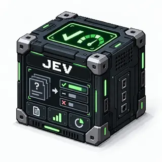

# Jev

Evaluate text or structured application state with **TypeSafe Jev**, then pass typed
judgments to the next block. Jev does not generate conversational text or run code.

[](https://docs.typesafe.ai/models)

<!-- block-metadata:start -->
[](model.json)
[](compatibility.json)
[](LICENSE)

Verified BloxSmith versions: **1.0.9** (bundled-block tests; see [test evidence](compatibility.json)).
<!-- block-metadata:end -->

[](media/cover.png)

*Concept illustration. [Artwork and generation prompt](media/README.md).*

## Quick start

1. Obtain a TypeSafe API key and store it in the BloxSmith wallet.
2. In **Settings**, enter its full reference, for example
   `secret://workspace/typesafe_api`. Do not paste a key into the block.
3. Keep `jev-latest`, or enter a versioned model ID to pin model behavior.
4. In **Questions**, add yes/no, choice or score questions. Give each a unique ID
   and complete instructions. Edit criteria as JSON; examples are supplied.
5. Apply, connect text or JSON to `state`, and connect `result` to a display,
   Python block or another JSON consumer. Execute the workflow.

The default question is a replaceable example: whether the message requests an action.
Example buttons insert English instructions; edit them for your own use case and data.

## Jev model version

The badge shows the default model configured in [`model.json`](model.json):
`jev-latest`. This is a moving alias, not a pinned model version. According to the
[TypeSafe model documentation](https://docs.typesafe.ai/models), it resolves to
`jev-1.13.0` as of September 23, 2026; TypeSafe may update the alias independently
of this block.

Each block instance can override the model in **Settings**. To keep the same model
version across calls, select an explicit versioned ID instead of the alias. The
`model` field in the `result` output reports the actual version used for that call.
The Jev model version and this BloxSmith block's package version are independent.

## Ports and output

| Port | Direction | Meaning |
| --- | --- | --- |
| `state` (#1) | Input, one link | Non-empty text, JSON object or array |
| `result` (#1) | Output, multiple subscribers | Complete `application/json` response |

JSON deliveries are explicitly parsed in Active Runtime. Plain text is never
automatically interpreted as JSON. Scalar JSON numbers, booleans, null, binary and
audio inputs are rejected. Objects retain values such as zero and false.

```json
{
  "model": "jev-1.13.0",
  "answers": {"requires_action": {"type": "noul", "noul": 0.93}},
  "usage": {"input_tokens": 45, "output_tokens": 12}
}
```

Numbers above illustrate the response shape, not expected judgments or costs.

## Questions

One logical request evaluates all independent questions against the same state.
Question IDs name output entries; Jev does not see them as instructions. Questions
cannot read each other's answers. If a later judgment depends on an earlier one,
use a subsequent execution/block with the necessary state.

- **Noul:** probability of yes (`noul`, 0–1). This is not intensity and has no
  separate confidence. Optional criteria contain `true` and `false` descriptions.
- **Choice:** one option (`choice`), all option probabilities, and `confidence`.
  Supply 2–255 named options with descriptions or `null`; include a no-match option
  when the list may not cover every input.
- **Score:** position across 2–10 concrete ordered descriptions (`score`), their
  `legend`, probabilities and `confidence`. Values range from 0 to N−1, and may
  be fractional. Describe situations, not just level numbers.

The advanced JSON editor supports structured instructions and criteria (objects or
arrays) without flattening them into text. The block permits up to 64 questions and
64,000 question characters. These are block limits, not a claim about API capacity.
Keep decisions and domain-specific thresholds downstream: confidence describes the
distribution, not truth or authorization to act.

## Execution, security and limits

Both **One Shot Simulation (`centralized`) and Active Runtime (`zeromq_active`)
make real API calls when executed**. Preparation validates config but performs no
network request or wallet lookup. A run with no input does not call Jev.

Requests go only to `https://api.typesafe.ai/v1/systemone`. Authentication is
resolved server-side for each activation; the secret is never persisted in block
configuration, process arguments, output or diagnostics. Standard HTTPS proxy and
CA environment settings are honored. Redirects are refused without forwarding
credentials. Inputs/questions are transmitted to TypeSafe and may be billable.

The total call deadline (including retries) defaults to 60 seconds, maximum 120.
Only HTTP 429/529 are retried, at most twice by default (configurable 0–3), with
backoff/`Retry-After`. Authentication errors, invalid requests and ambiguous network
failures are not retried. Provider token limits still apply independently of the
64,000-character default state limit (configurable up to 250,000).

The HTTP response is bounded to 512 KiB. Invalid, partial, missing or out-of-range
answers fail without emitting a synthetic fallback. Validated answers preserve
probabilities; unknown provider fields are excluded. Errors never echo raw provider
bodies. Runtime cancellation/timeout terminates the owned HTTP process and emits
nothing. On POSIX a lifetime pipe also retires it if its managed host is killed.
Cancellation stops local work, not any billing already incurred at the provider.

No sessions, external tools, hidden instruction channels or framework changes.
Properties are block-owned ES modules, release-scoped CSS and English/French
catalogs, with keyboard tabs, internal scrolling and fixed Close/Apply actions.
Settings remain drafts until Apply; edits apply according to the framework's
ordinary run-config lifecycle.

## Verification

`tests/F5.33_jev_block.py` covers FB1–FB3: request/response contracts, frozen
preparation config, wallet safety, input types, errors, redirects, bounded retries,
cancellation/timeouts, host death and real managed/linked installations in both
runtimes. The fake provider uses a temporary TLS proxy and certificate; production
package sources and API endpoint are not rewritten. No real credential is needed.

`tests/F8.33_jev_release_ui.py` covers FB4: real browser mounting, editing, Apply,
English/French, keyboard operation and desktop/narrow layouts. Tests require the
workspace's isolated framework harness, Chromium/Playwright and OpenSSL; these are
test dependencies, not runtime SDK dependencies. Runtime uses Python's standard library.
Automated tests do not certify live service availability or model judgment quality.
Only exact compatibility recorded below is verified; other platforms are unverified.

## References

- [TypeSafe API](https://docs.typesafe.ai/api)
- [Model IDs and aliases](https://docs.typesafe.ai/models)
- [Choice](https://docs.typesafe.ai/primitives/choice), [Noul](https://docs.typesafe.ai/primitives/noul), [Score](https://docs.typesafe.ai/primitives/score)
- [Batching independent questions](https://docs.typesafe.ai/cookbooks/parallel_questions)

## License

Apache-2.0. See [LICENSE](LICENSE). TypeSafe and BloxSmith remain separate products
with their own terms; this package does not distribute their services or framework.

## Properties ergonomics

Modal and inspector styles are owned by this package and scoped to its exact
release. Forms adapt to narrow panels, checkboxes stay beside their labels, and
long values do not widen the inspector. Existing labels are associated with
controls; keyboard navigation complements the block’s own tab handlers.
These presentation helpers do not change port bindings, authored settings,
runtime behavior or the block’s original surface cleanup.
